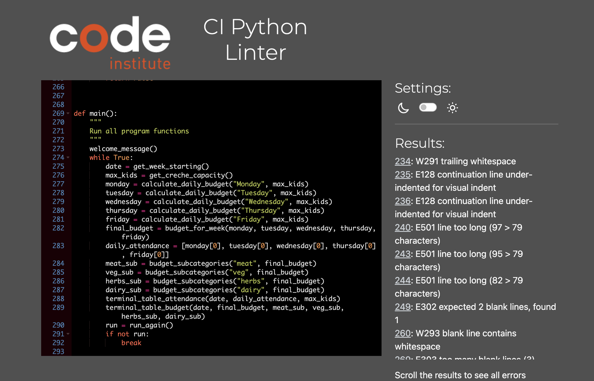

# Creche Budget Calculator

The Creche Budget Calculator is designed to help the users to organise the weekly food budget for their creche.

It can calculate the total budget for the creche per week and also allocate that budget to a few subcategories like meat, veg and dairy.

Visit the deployed application [here](https://creche-budget-calculator-b01b347ae64b.herokuapp.com/).

## Table of Contents
1. [User Experience (UX)](#user-experience-UX)
    1. [Project Goals](#project-goals)
    2. [User Stories](#user-stories)
    3. [Color Scheme](#color-scheme)
    4. [Data Model](#data-model)
    5. [Flowchart](#flowchart)
2. [Features](#features)
    1. [Date Entry](#date-entry)
    2. [Creche Capacity Entry](#creche-capacity-entry)
    3. [Predicted Attendance Entry](#predicted-attendance-entry)
    4. [Weekly Budget Calculator](#weekly-budget-calculator)
    5. [Budget Subcategory Calculator](#budget-subcategory-calculator)
    6. [Restart Program](#restart-program)
    7. [Future Features](#future-features)
3. [Technologies Used](#technologies-used)
    1. [Language Used](language-used)
    2. [Frameworks, Libraries and Programs Used](#frameworks-libraries-and-programs-used)
4. [Testing](#testing)
    1. [Testing User Stories](#testing-user-stories)
    2. [Code Validation](#code-validation)
    3. [Manual Testing](#manual-testing)
5. [Deployment](#deployment)
6. [Credits](#credits)
7. [Acknowledgements](#acknowledgements)

***

## User Experience (UX)

### Project Goals

* Have a welcome page that explains the calculator enough that its easy to use even for the first time.

* Every stage in the program is intuitive and the user understands what they need to do next easily.

* Input validation will be present so that the correct data types are entered into the calculator, thus reducing the chance of errors occuring.

* The outputted data should be easy to understand and display clearly.

* The program should continue to run until the user is finished with it.

### User Stories

* As a user, I want to be able to easily understand the purpose and use of the program.

* As a user, I want to be able to easily understand what data and data type I am required to input at each input step.

* As a user, I want to receive feedback about the data I entered so I know it was accepted.

* As a user, I want my inputs to be displayed in an easy to read manner so that I remember what data I entered and check that I did not make any mistakes.

* As a user, I want the output to be displayed in a easy to read manner so there is no confusion what I am looking at.

### Color Scheme

[Colorama](https://pypi.org/project/colorama/) was the library used to add color to the program.

A simple color scheme was used to make the code more aesthetically pleasing within the terminal. Blue font was used for titles, green for positive input acception and red for error messages.

The input and output table was also given a magenta color to help it stand out from the rest of the terminal.

### Data Model

Simple data such as the date and the capacity are stored and returned as variables

More complex variables like attendance and daily budget are stored on variables and returned as lists.

The calculations are stored to variables so that they can be formatted and displayed back to the user.

### Flowchart 

The flowchart was designed using [Miro](https://miro.com/). It was used to help plan the logic implemented in the program.

As shown in the flowchart the process has changed and some functionality was added and dropped during development but the main idea demonstrated is the same.

[Back to top ^](#creche-budget-calculator)

## Features

### Date Entry

Collects the date of the Monday of the week and stores it to a variable. This is useful for when the output displays later. If the user runs the program multiple times for different weeks the date will help them differenciate between each output.

### Creche Capacity Entry

Collects the total capacity of the users creche and stores it to a variable. This is then displayed in the output and is also used to limit the predicted attendance input so the user cannot enter a value higher than the capacity they entered.

### Predicted Attendance Entry

Collects the attendance on each weekday and stores it as a variable which will be used later to calculate the total budget for the week and also to display in the output.

### Weekly Budget Calculator

Using the inputted attendance the program multiplies it by the fixed variable containing the budget of the individual child. The program stores this on a variable on a list, along with the attendance, which in turn is returned and used to display in the final output and also to help calculate the budget of the subcategories.

### Budget Subcategory Calculator

Takes the total budget and depending on the specific subcategory allocates a percentage of the total budget to a variable and returns it for the output.

### Inputs Displayed

The inputs the user has put into the program are displayed at the end so that they can be reviewed in case of error. They are displayed in a table format.

### Outputs Displayed

The outputs the user receives are clearly displayed on a neat table in the terminal.

### Restart Program

Gives the user the option to run the program again or to quit out.

### Future Features

* The developer is planning to later add options to alter the budget depending on dietry preferences. For example if there is a vegetarian present to reduce the meat budget and increase the veg budget for that one child. This was decided not to be entered yet as it may take away the intuitiveness of the program.

* The ability to export the output onto an excel spreadsheet or google sheet will also be implemented at a later date. 

[Back to top ^](#creche-budget-calculator)

## Technologies Used

### Language Used

* [Python3](https://en.wikipedia.org/wiki/Python_(programming_language)) was the programming language used to create this program

### Frameworks, Libraries and Programs Used

* [GitHub](https://github.com/) was used to store the project in a repository.

* [GitPod](https://gitpod.io/) was used to write and edit code, commit and push to GitHub.

* [Heroku](https://id.heroku.com/) was used to deploy the application.

* [CI Python Linter](https://pep8ci.herokuapp.com/#) was used to help validate the code.

* [PrettyTable](https://pypi.org/project/prettytable/) library was used to help display the output in an easy to read manner.

* [Colorama](https://pypi.org/project/colorama/) was used to apply color to the terminal to improve its design.

* [Miro](https://miro.com/) was used to help generate the projects flowchart.

[Back to top ^](#creche-budget-calculator)

## Testing

### Testing User Stories

* As a user, I want to be able to easily understand the purpose and use of the program.

    - The welcome page gives the user clear and simple instructions on how to use the program.

    - The program provides clear instructions throughout so that the user knows exactly what they are doing at each step.

    - The outputs are clearly labeled and displayed well so that the user knows what everything means.

* As a user, I want to be able to easily understand what data and data type I am required to input at each input step.

    - The input messages give clear instructions on what type of input is expected each time.

* As a user, I want to receive feedback about the data I entered so I know it was accepted.

    - Each input informs you when the data entered was accepted or if it wasn't it alerts you and gives you the opportunity to enter it again.

* As a user, I want my inputs to be displayed in an easy to read manner so that I remember what data I entered and check that I did not make any mistakes.

    - The inputs are displayed as easy to read tables within the terminal so the user can check the entered the correct data.

* As a user, I want the output to be displayed in a easy to read manner so there is no confusion what I am looking at.
    
    - The outputs are displayed on an easy to read table within the terminal, with each output clearly labeled to avoid confusion.

### Code Validation

The [CI Python Linter](https://pep8ci.herokuapp.com/#) was used during development to validate the Python code for PEP8 requirements

* Before Validation:

* After Validation:

### Manual Testing

<table>
    <tr>
        <th>Feature</th>
        <th>Input</th>
        <th>Expected Outcome</th>
        <th>Result</th>
        <th>Pass/Fail</th>
    </tr>
    <tr>
        <td rowspan=4>Date Entry Year</td>
        <td>Empty</td>
        <td>Error and try again</td>
        <td></td>
        <td>Pass</td>
    </tr>
    <tr>
        <td>Value below four digits</td>
        <td>Error and try again</td>
        <td></td>
        <td>Pass</td>
    </tr>
    <tr>
        <td>Value is not a number</td>
        <td>Error and try again</td>
        <td></td>
        <td>Pass</td>
    </tr>
    <tr>
        <td>Value is negative</td>
        <td>Error and try again</td>
        <td></td>
        <td>Pass</td>
    </tr>
    <tr>
        <td rowspan=4>Date Entry Month</td>
        <td>Empty</td>
        <td>Error and try again</td>
        <td></td>
        <td>Pass</td>
    </tr>
    <tr>
        <td>Value above 12 months</td>
        <td>Error and try again</td>
        <td></td>
        <td>Pass</td>
    </tr>
    <tr>
        <td>Value is negative</td>
        <td>Error and try again</td>
        <td></td>
        <td>Pass</td>
    </tr>
    <tr>
        <td>Value is not a number</td>
        <td>Error and try again</td>
        <td></td>
        <td>Pass</td>
    </tr>
    <tr>
        <td rowspan=5>Date Entry Day</td>
        <td>Value is empty</td>
        <td>Error and try again</td>
        <td></td>
        <td>Pass</td>
    </tr>
    <tr>
        <td>Value above 31 days</td>
        <td>Error and try again</td>
        <td></td>
        <td>Pass</td>
    </tr>
    <tr>
        <td>Value is above 29 on a February</td>
        <td>Error and try again</td>
        <td></td>
        <td>Pass</td>
    </tr>
    <tr>
        <td>Value is negative</td>
        <td>Error and try again</td>
        <td></td>
        <td>Pass</td>
    </tr>
    <tr>
        <td>Value is not a number</td>
        <td>Error and try again</td>
        <td></td>
        <td>Pass</td>
    </tr>
    <tr>
        <td rowspan=4>Creche Capacity Entry</td>
        <td>Value is empty</td>
        <td>Error and try again</td>
        <td></td>
        <td>Pass</td>
    </tr>
    <tr>
        <td>Value is negative</td>
        <td>Error and try again</td>
        <td></td>
        <td>Pass</td>
    </tr>
    <tr>
        <td>Value is zero</td>
        <td>Error and try again</td>
        <td></td>
        <td>Pass</td>
    </tr>
    <tr>
        <td>Value is not a number</td>
        <td>Error and try again</td>
        <td></td>
        <td>Pass</td>
    </tr>
    <tr>
        <td rowspan=3>Predicted Attendance Entry</td>
        <td>Value is empty</td>
        <td>Error and try again</td>
        <td></td>
        <td>Pass</td>
    </tr>
    <tr>
        <td>Value is negative</td>
        <td>Error and try again</td>
        <td></td>
        <td>Pass</td>
    </tr>
    <tr>
        <td>Value is not a number</td>
        <td>Error and try again</td>
        <td></td>
        <td>Pass</td>
    </tr>
    <tr>
        <td rowspan=3>Restart Program</td>
        <td>Value is neither "y" or "n"</td>
        <td>Error and try again</td>
        <td></td>
        <td>Pass</td>
    </tr>
    <tr>
        <td>Value is a number</td>
        <td>Error and try again</td>
        <td></td>
        <td>Pass</td>
    </tr>
    <tr>
        <td>Value is empty</td>
        <td>Error and try again</td>
        <td></td>
        <td>Pass</td>
    </tr> 
</table>

[Back to top ^](#creche-budget-calculator)

## Deployment

The application was deployed using [Heroku](https://id.heroku.com/).

The following instructions explain how to deploy to Heroku:

1. Create a requirements.txt file within the explorer and run: `pip3 freeze > requirements.txt` in the console.
2. Commit and push changes to GitHub.
3. Navigate to the Heroku's website.
4. From the Heroku dashboard, select the "Create new app" option.
5. Enter the "App Name" and "Choose a Region", then click on "Create App".
6. Go to "Config Vars" in the "Settings" tab.
7. Click the "Reveals Config Vars" and add the Key: Creds and the Value stored in creds.json file if required.
8. Add the Config Var, KEY: Port and Value: 8000.
9. Go to the "Buildpacks" section and click "Add Buildpack".
10. Select "python" and then "Save Changes".
11. Add "nodejs" buildpack as well following the same instructions at step 9.
12. Go to "Deployment Method", in the "Deploy" tab select "GitHub" then select "Connect to GitHub".
13. Go to "Connect to GitHub" section and "Search" the repository that you wish to deploy.
14. Select "Connect" beside the repositories name.
15. Choose "Automatic Deploys" or "Manual Deploys" to deploy your application.

[Back to top ^](#creche-budget-calculator)

## Credits

### Content

* Inspiration for the calculator came from the developers current workplace. The creche the developer works in relies on someone in the office to calculate the budgets each week and send a spreadsheet to each creche with their food budget information. The developers intention was to streamline this process.

### Code

* [Stack Overflow](https://stackoverflow.com/) was consulted frequently for inspiration and troubleshooting code throughout development.

* [PyPI](https://pypi.org/) was consulted for instructions on how to install and use PrettyTables.

## Acknowledgements

* My partner and family for all their love and support during this course and this project.

* My mentor Marcel for all his sound advice and help over the last few months.

* Code Institute and its great Slack community for their support and providing me with the course material to help me develop this project.